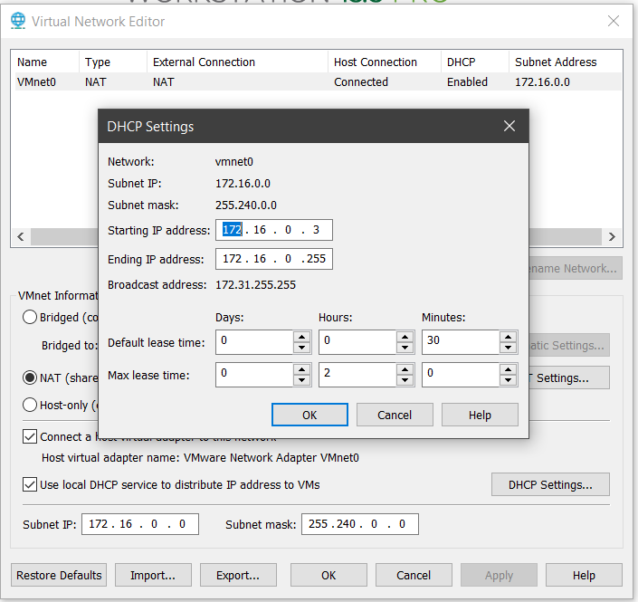
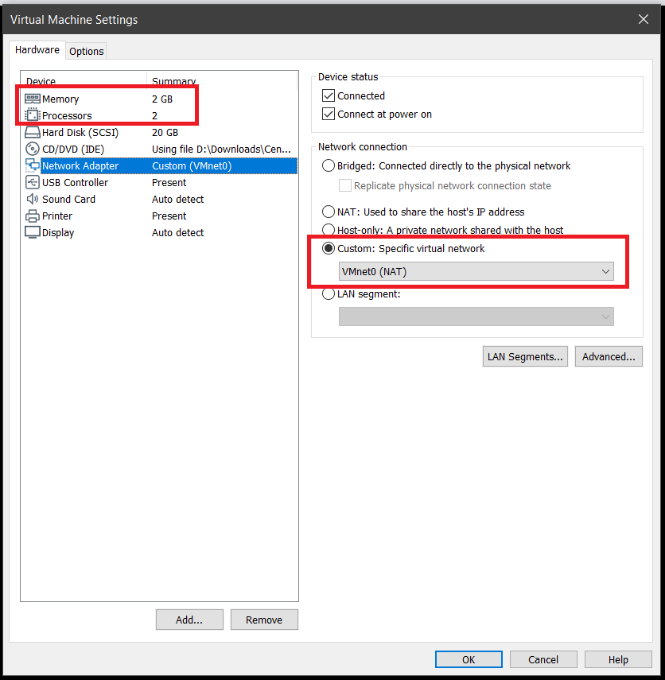

## Author's Note

This is a very long article which is a product of all my notes and research throughout my journey to learning Kubernetes and Open Source Technologies.

Special thanks to "Me and Open Source" Youtube Channel for some wonderful tutorials on Kubernetes.

## Summary
1. [Create Simple NAT on VMWare Network Editor](#1.-create-simple-nat-on-vmware-network-editor)
2. [Create CentOS 7 Virtual Machine](#2.-create-a-centos-7-virtual-machine)
3. [Install Kubernetes and its dependencies](#3.-install-kubernetes-and-its-dependencies)
4. [Deploy a Network Policy](#4.-deploy-a-network-policy)
6. [Initialize Kubernetes](#5.-initialize-kubernetes)
6. [Kubernetes Cheatsheet](#6.-kubernetes-cheatsheet)

## 1. Create Simple NAT on VMWare Network Editor

In order for our virtual machines to talk to each other, we need a dedicated virtual network. Below is a simple NAT configuration:

    https://github.com/cyberpau/book-of-gists/tree/master/configs/VMWare-Network

Download the file and import it using VMWare Network Editor. For this example, we will have a starting IP address of `172.16.0.3` - `172.16.0.255`

## 2. Create a CentOS-7 Virtual Machine

Install by default and configure the settings as necessary. Make sure we are using the custom network imported.

*See video* [*How to Install CentOS 7 on VMware Workstation 14 Pro?*](https://www.youtube.com/watch?v=LsXQwnnL4bI) *for details*

Note: For Master Node: atleast 2gb RAM and 2 cores, for Worker Nodes: atleast 1gb RAM and 1 core. on step #1 (vmnet0).

Lastly, try to update the packages. It may take some time depending on your internet connection

    yum -y update
    yum -y install net-tools wget telnet yum-utils device-mapper-persistent-data lvm2

In case you are having internet connection issues, please run the script below and try to update the packages again:

    dhclient -v

## 3. Install Kubernetes and its dependencies

Note: I won't go into the details of this script, you can check the official installation documentation on Kubernetes' website.

Run the script below:

    wget -O - https://raw.githubusercontent.com/cyberpau/book-of-gists/master/automation-scripts/install-k8s-docker-on-centOS-8.sh | bash

Alternatively, you can run the commands one by one or create a bash script (.sh):

    #!/bin/bash
    # Authored by John Paulo Mataac

    if [[ $EUID > 0 ]]
    then echo "Exiting... Please run as root"
    exit
    fi

    ### Update and install prerequisite tools
    yum -y update
    yum -y install net-tools wget telnet yum-utils device-mapper-persistent-data lvm2

    ### Add Docker repository.
    yum-config-manager --add-repo https://download.docker.com/linux/centos/docker-ce.repo

    ### Install Docker CE.
    yum install -y docker-ce-18.06.2.ce

    ### Create /etc/docker directory.
    mkdir /etc/docker

    ### Setup daemon.
    cat > /etc/docker/daemon.json <<EOF
    {
    "exec-opts": ["native.cgroupdriver=systemd"],
    "log-driver": "json-file",
    "log-opts": {
    "max-size": "100m"
    },
    "storage-driver": "overlay2",
    "storage-opts": [
    "overlay2.override_kernel_check=true"
    ]
    }
    EOF

    mkdir -p /etc/systemd/system/docker.service.d

    ### Restart Services
    systemctl daemon-reload
    systemctl enable docker
    systemctl restart docker

    ### Disable swap
    swapoff -a
    sed -i 's/^\(.*swap.*\)$/#\1/' /etc/fstab 

    ### load netfilter probe specifically
    modprobe br_netfilter

    ### disable SELinux. If you want this enabled, comment out the next 2 lines. But you may encounter issues with enabling SELinux
    setenforce 0
    sed -i 's/^SELINUX=enforcing$/SELINUX=permissive/' /etc/selinux/config

    ### Install kubernetes packages
    cat <<EOF > /etc/yum.repos.d/kubernetes.repo
    [kubernetes]
    name=Kubernetes
    baseurl=https://packages.cloud.google.com/yum/repos/kubernetes-el7-x86_64
    enabled=1
    gpgcheck=1
    repo_gpgcheck=1
    gpgkey=https://packages.cloud.google.com/yum/doc/yum-key.gpg https://packages.cloud.google.com/yum/doc/rpm-package-key.gpg
    EOF

    yum -y install kubectl kubelet kubeadm
    systemctl  restart kubelet && systemctl enable kubelet

    ### Enable IP Forwarding
    echo '1' > /proc/sys/net/bridge/bridge-nf-call-iptables
    cat <<EOF >  /etc/sysctl.d/k8s.conf
    net.bridge.bridge-nf-call-ip6tables = 1
    net.bridge.bridge-nf-call-iptables = 1
    EOF

    ### Restarting services
    systemctl daemon-reload
    systemctl restart kubelet

    ### Install nfs utils for Kubernetes NFS driver
    yum -y install nfs-utils

## 4. Deploy a Network Policy

*See https://github.com/cyberpau/book-of-gists/tree/master/network-policies*

## 5. Initialize Kubernetes

## 6. Kubernetes Cheatsheet

Get started with kubectl (command line tool): https://kubernetes.io/docs/reference/kubectl/overview/

The official cheatsheet of commands: https://kubernetes.io/docs/reference/kubectl/cheatsheet/

Common Operators (based from kubernetes.io):

`kubectl apply` - Apply or Update a resource from a file or stdin.

    # Create a service using the definition in example-service.yaml.
    kubectl apply -f example-service.yaml

    # Create a replication controller using the definition in example-controller.yaml.
    kubectl apply -f example-controller.yaml

    # Create the objects that are defined in any .yaml, .yml, or .json file within the <directory> directory.
    kubectl apply -f <directory>

`kubectl get` - List one or more resources.

    # List all pods in plain-text output format.
    kubectl get pods

    # List all pods in plain-text output format and include additional information (such as node name).
    kubectl get pods -o wide

    # List the replication controller with the specified name in plain-text output format. Tip: You can shorten and replace the 'replicationcontroller' resource type with the alias 'rc'.
    kubectl get replicationcontroller <rc-name>

    # List all replication controllers and services together in plain-text output format.
    kubectl get rc,services

    # List all daemon sets in plain-text output format.
    kubectl get ds

    # List all pods running on node server01
    kubectl get pods --field-selector=spec.nodeName=server01

`kubectl describe `- Display detailed state of one or more resources, including the uninitialized ones by default.

    # Display the details of the node with name <node-name>.
    kubectl describe nodes <node-name>

    # Display the details of the pod with name <pod-name>.
    kubectl describe pods/<pod-name>

    # Display the details of all the pods that are managed by the replication controller named <rc-name>.
    # Remember: Any pods that are created by the replication controller get prefixed with the name of the replication controller.
    kubectl describe pods <rc-name>

    # Describe all pods
    kubectl describe pods

`kubectl delete` - Delete resources either from a file, stdin, or specifying label selectors, names, resource selectors, or resources.

    # Delete a pod using the type and name specified in the pod.yaml file.
    kubectl delete -f pod.yaml

    # Delete all the pods and services that have the label '<label-key>=<label-value>'.
    kubectl delete pods,services -l <label-key>=<label-value>

    # Delete all pods, including uninitialized ones.
    kubectl delete pods --all

`kubectl exec` - Execute a command against a container in a pod.

    # Get output from running 'date' from pod <pod-name>. By default, output is from the first container.
    kubectl exec <pod-name> -- date

    # Get output from running 'date' in container <container-name> of pod <pod-name>.
    kubectl exec <pod-name> -c <container-name> -- date

    # Get an interactive TTY and run /bin/bash from pod <pod-name>. By default, output is from the first container.
    kubectl exec -ti <pod-name> -- /bin/bash

`kubectl logs `- Print the logs for a container in a pod.

    # Return a snapshot of the logs from pod <pod-name>.
    kubectl logs <pod-name>

    # Start streaming the logs from pod <pod-name>. This is similar to the 'tail -f' Linux command.
    kubectl logs -f <pod-name>

    